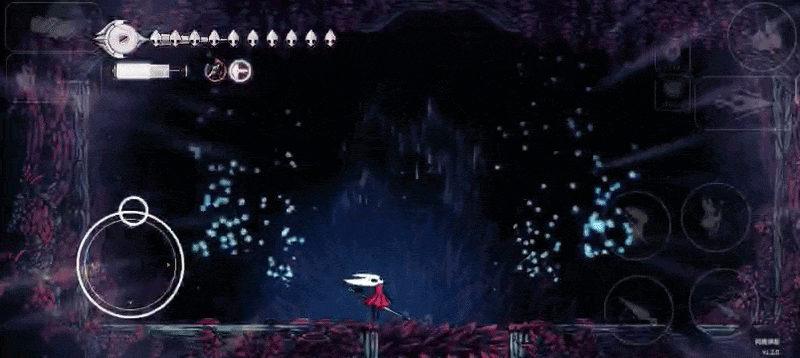

# Red-Reversal
Gojo's red reversal mod now on android 
How to use?
1.Get the mount fay silkshot variant 
2.Normally using it would change its sprites 
3.To charge it 3 finger should be used 
for eg.
if the silkshot is the only thing equipped,hold the ability button + 2 extra finger else where to charge it
if the silkshot is in the red slot of wanderer with any silk ability use up+ability/cast+1 extra finger else where to charge 

The more you charge it more damage it will do 
Maximum is 5x damage with the charge of 6s

